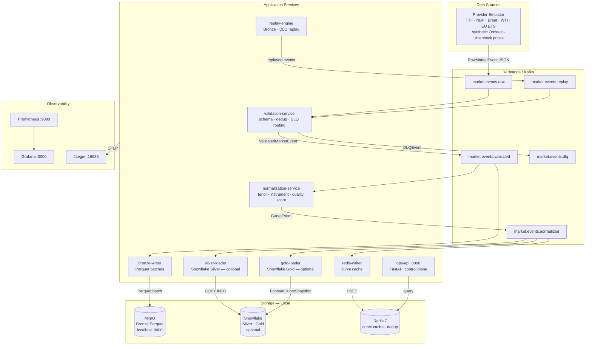
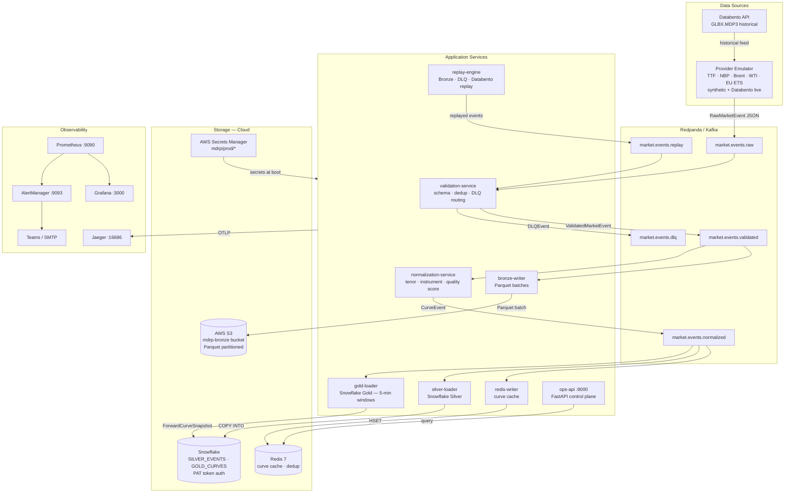

# Market Data Reliability Platform

A cloud-native streaming and batch pipeline for ingesting, validating, and serving energy forward curves — built to tolerate unreliable upstream market data providers.


---

## Live Stack

The full platform is deployed and running on AWS EC2 (us-east-2). Access credentials and verification steps are in [EVAL_GUIDE.md](EVAL_GUIDE.md).

| Service | URL |
|---------|-----|
| Ops API | `http://<HOST>:8000` |
| Grafana | `http://<HOST>:3000` |
| Prometheus | `http://<HOST>:9090` |
| Jaeger | `http://<HOST>:16686` |

> `<HOST>` is the EC2 public IP — see EVAL_GUIDE.md for the current value and all credentials.

The cloud stack runs via `docker-compose.cloud.yml` on a single EC2 instance — real AWS S3 for Bronze storage, Snowflake for Silver/Gold layers, secrets pulled from Secrets Manager on bootstrap. To run locally instead, see [Quick Start](#quick-start) below (uses MinIO in place of S3, no cloud account needed).

---

## Problem Statement

External market data providers — ICE, CME, Bloomberg, Refinitiv — are production-critical dependencies for any commodity trading desk, yet they fail in ways that are subtle and damaging: duplicate ticks that corrupt VWAP calculations, stale curves served without a staleness flag, partial forward curve deliveries that leave tenors blank, schema field renames that break downstream parsers silently. When any of these occur, the standard industry response is a mix of manual data checks, ad-hoc SQL patches, and phone calls. That is not a reliability strategy.

The consequences compound quickly in energy markets. A gas trading desk relying on a TTF forward curve that is missing the M+3 tenor, or that was last updated six hours ago, is pricing risk against stale data. If that error is not detected before the trade is booked, it cannot be undone. Settlement and risk models downstream inherit the contaminated data. The cost is not just a bad mark-to-market; it is a control failure.

This platform treats provider unreliability as a first-class engineering problem. Every event is schema-validated, deduplicated via an atomic Redis SETNX operation, scored for quality, and routed to a dead-letter queue if it fails validation — with full structured tracing from ingestion to storage. Raw events are written immutably to Bronze (S3 Parquet in cloud mode, MinIO locally), allowing forensic replay of any provider incident. Normalised curves land in Snowflake Silver and Gold layers, and the latest snapshot of every forward curve is served from Redis with sub-millisecond latency. The entire pipeline is observable through Prometheus metrics, Grafana dashboards, Jaeger distributed traces, and AlertManager-routed notifications to Microsoft Teams and SMTP.

---

## Architecture

The pipeline has two deployment modes — the data flow and services are identical; only the storage layer and infrastructure differ.

| | Local (`docker-compose.yml`) | Cloud (`docker-compose.cloud.yml`) |
|---|---|---|
| **Bronze storage** | MinIO (Docker container) | AWS S3 (`mdrp-bronze` bucket) |
| **Silver / Gold** | Optional — loaders no-op if Snowflake not configured | Snowflake (`MARKET_DATA` database) |
| **Secrets** | `.env` file | AWS Secrets Manager |
| **Data source** | Synthetic emulator only | Emulator + Databento historical |
| **Infrastructure** | Single machine, all containers local | EC2 instance (m7i-flex.large, us-east-2) |

---

### Local Mode — Data Flow



---

### Cloud Mode — Data Flow



    OA -->|query| RD
    OA -->|submit job| RD
    OA -->|webhook| TM

    PR -->|scrape| Services
    PR --> GR
    PR --> AM
    AM --> OA
    OA --> TM
    Services -->|OTLP spans| JA
```

### Layer Descriptions

| Layer | Components | Responsibility |
|---|---|---|
| **Emulation** | provider-emulator, databento_adapter | Generates synthetic energy forward curve events with configurable fault injection; wraps Databento SDK for live historical feeds |
| **Streaming** | Redpanda v24.1, 5 topics | Durable ordered event log; Kafka-compatible API; Schema Registry on :8081; REST Proxy (Pandaproxy) on :9645 |
| **Validation** | validation-service | Schema enforcement, atomic Redis deduplication (SETNX/EX), timestamp bounds check, DLQ routing for every failure category |
| **Storage (Bronze)** | bronze-writer, MinIO/S3 | Immutable Parquet files partitioned `bronze/{provider}/{YYYY-MM-DD}/{HH}/events_{uuid}.parquet`; offset only committed on successful flush |
| **Normalisation** | normalization-service | Canonical tenor and instrument mapping, quality scoring (1.0 minus per-fault penalties), Redis INCR version counter per curve |
| **Serving** | redis-writer, Redis 7 | Latest-value cache per curve; provider health snapshots with rolling quality p50/p95; staleness detection |
| **Persistence (Silver/Gold)** | silver-loader, gold-loader | Incremental Snowflake COPY INTO for CurveEvent rows (Silver) and reconciled ForwardCurveSnapshot tables (Gold) |
| **Replay** | replay-engine | Three modes: Bronze S3 (re-read Parquet by time window), DLQ (retry failed events), Databento historical (backfill via SDK) |
| **Control Plane** | ops-api | FastAPI: health endpoints, replay job submission, curve queries, DLQ inspection, AlertManager webhook receiver |
| **Observability** | Prometheus, Grafana, Jaeger, AlertManager | Per-service Prometheus scrape (15 s interval); dashboards auto-provisioned; OTLP traces to Jaeger; alert routing to Teams + SMTP |

### Kafka Topics

| Topic | Partitions | Retention | Purpose |
|---|---|---|---|
| `market.events.raw` | 6 | 7 days | Raw `RawMarketEvent` JSON from all providers, pre-validation. Fault-tagged events land here unchanged. |
| `market.events.validated` | 6 | 7 days | `ValidatedMarketEvent` from validation-service. Deduplicated and schema-confirmed. |
| `market.events.normalized` | 6 | 7 days | Canonical `CurveEvent` from normalization-service. Tenor-mapped, quality-scored, versioned. |
| `market.events.replay` | 3 | 7 days | Events re-injected by the replay-engine (Bronze, DLQ, or Databento). Marked `is_replay=true`. |
| `market.events.dlq` | 3 | 7 days | `DLQEvent` for all validation failures. Full original payload preserved for forensic inspection and replay. |

---

## Services

| Service | Metrics Port | HTTP Port | Consumes | Produces | Purpose |
|---|---|---|---|---|---|
| provider-emulator | 8001 | — | — | `market.events.raw` | Synthetic energy curve generation with configurable fault injection; optional Databento historical feed |
| validation-service | 8002 | — | `market.events.raw` | `market.events.validated`, `market.events.dlq` | Schema validation, Redis deduplication, timestamp bounds, DLQ routing |
| bronze-writer | 8003 | — | `market.events.validated` | S3/MinIO Parquet | Immutable Bronze writes; offset committed only on successful S3 flush |
| normalization-service | 8004 | — | `market.events.validated` | `market.events.normalized` | Tenor/instrument normalisation, quality scoring, Redis version counters |
| redis-writer | 8005 | — | `market.events.normalized` | Redis `HSET` | Latest curve snapshot cache; provider health tracking and staleness detection |
| replay-engine | 8006 | — | Redis jobs | `market.events.replay` | Bronze S3 replay, DLQ replay, Databento historical replay |
| ops-api | 8007 | 8000 | Redis, Kafka | Redis jobs, Teams/SMTP | FastAPI control plane: health, replay, curves, DLQ, AlertManager webhook |
| silver-loader | 8008 | — | `market.events.normalized` | Snowflake `SILVER_EVENTS.CURVE_EVENTS` | Incremental COPY INTO for CurveEvent rows; batches 1000 events, flushes every 60 s |
| gold-loader | 8009 | — | `market.events.normalized` | Snowflake `GOLD_CURVES.FORWARD_CURVE_SNAPSHOTS` | 5-minute tumbling window assembly; MERGE upsert on `(curve_name, as_of)` |

---

## Quick Start

### Prerequisites

- Docker Desktop (or Docker Engine + Compose plugin)
- `make` (optional — commands are listed below if not available)
- 4 GB RAM available for Docker

### Start the stack

```bash
git clone https://github.com/lokeshpeta6y-cloud/market-data-reliability-platform.git
cd market-data-reliability-platform

# Copy and review environment config
cp .env.example .env

# Start all services (Redpanda, Redis, MinIO, Prometheus, Grafana, Jaeger,
# AlertManager, and all 9 application services)
docker compose up -d

# Wait ~30 seconds for services to initialise and topics to be created
# then check all service health endpoints
make health
```

### UI access

| Interface | URL | Credentials |
|---|---|---|
| Grafana dashboards | http://localhost:3000 | admin / mdrp_grafana |
| ops-api Swagger docs | http://localhost:8000/docs | — |
| ops-api ReDoc | http://localhost:8000/redoc | — |
| Prometheus | http://localhost:9090 | — |
| Jaeger UI | http://localhost:16686 | — |
| MinIO console | http://localhost:9001 | mdrp / mdrp_secret_local |
| Redpanda admin | http://localhost:9644 | — |
| Schema Registry | http://localhost:8081 | — |
| AlertManager | http://localhost:9093 | — |

### Verify the pipeline is running

```bash
# Check a forward curve is being served from Redis
curl http://localhost:8000/api/v1/curves/TTF

# List recent DLQ events (fault-injected events land here)
curl http://localhost:8000/api/v1/dlq?limit=10

# Check provider health
curl http://localhost:8000/api/v1/providers

# View all replayed jobs
curl http://localhost:8000/api/v1/replay
```

---

## Provider Emulator and Fault Injection

The `provider-emulator` service generates synthetic EEX/CME-style energy forward curves for six instruments (TTF, NBP, TTF_POWER, Brent, WTI, EU ETS) and publishes them to `market.events.raw` on a configurable interval (default: every 5 seconds).

### Fault types

Each fault is applied probabilistically and independently. An event can accumulate multiple fault annotations, all of which are recorded in the `injected_faults` field of the `RawMarketEvent` and propagated through the pipeline.

| Fault | Default rate | Behaviour |
|---|---|---|
| `DUPLICATE` | 2% | Publishes the original event twice with the same `event_id`. The validation service must detect and discard the second copy via Redis SETNX. |
| `MALFORMED` | 1% | Randomly nulls a required field, replaces a numeric value with `~~CORRUPTED~~`, empties the payload dict, or sets price to a negative value. |
| `DELAYED` | 5% | Holds the event in an internal queue for 2–30 seconds before publishing. Simulates network buffering and provider backpressure. |
| `OUT_OF_ORDER` | 3% | Holds the event briefly (0.5–5 s) and releases it shuffled relative to neighbours. Simulates TCP reordering or multi-source fan-in. |
| `SCHEMA_DRIFT` | 0.5% | Renames 1–3 payload fields to alternate names (e.g. `price` → `px`, `tenor` → `delivery_tenor`). Simulates undocumented provider API changes. |
| `STALE` | 1% | Backdates `event_timestamp` by 2–24 hours. Simulates a provider replaying cached data without updating timestamps. |
| `PARTIAL_CURVE` | 2% | Drops 20–50% of tenors from a forward curve batch. Simulates incomplete curve delivery from a struggling provider endpoint. |

### Configuring fault rates

All rates are independently configurable via environment variables. Set any rate to `0.0` to disable that fault type entirely, or `1.0` to force it on every event.

```bash
# In .env or docker compose environment block
FAULT_RATE_DUPLICATE=0.10      # 10% duplicate rate
FAULT_RATE_MALFORMED=0.0       # disable malformed faults
FAULT_RATE_DELAYED=0.20        # high delay rate
FAULT_RATE_OUT_OF_ORDER=0.0
FAULT_RATE_SCHEMA_DRIFT=0.05
FAULT_RATE_STALE=0.0
FAULT_RATE_PARTIAL_CURVE=0.0
PUBLISH_INTERVAL_SECONDS=2.0   # emit curves every 2 seconds
```

### Example scenarios

**ICE outage simulation** — set all rates to zero except staleness and partial curves to mimic a degraded-but-not-dead provider:

```bash
FAULT_RATE_STALE=0.8
FAULT_RATE_PARTIAL_CURVE=0.5
FAULT_RATE_DELAYED=0.3
```

**Schema drift test** — validate that the validation service correctly rejects or handles renamed fields:

```bash
FAULT_RATE_SCHEMA_DRIFT=1.0
FAULT_RATE_MALFORMED=0.0
```

**Duplicate storm** — test deduplication throughput under heavy duplicate load:

```bash
FAULT_RATE_DUPLICATE=0.5
PUBLISH_INTERVAL_SECONDS=1.0
```

---

## Replay

The `replay-engine` polls Redis for `ReplayJob` records submitted by the ops-api and executes the appropriate replayer. Only one job runs at a time to keep Kafka producer resource usage predictable.

Jobs are submitted via the ops-api REST endpoint and tracked in Redis with status transitions: `pending` → `running` → `completed` / `failed`.

### Mode 1: Bronze S3 replay

Reads Parquet files from the Bronze bucket for the specified provider and time window, deserialises each `RawMarketEvent`, marks it `is_replay=true` with `replay_source=bronze_s3`, and republishes to `market.events.replay`.

```bash
# Replay TTF events for the last 2 hours from Bronze
curl -X POST http://localhost:8000/api/v1/replay \
  -H "Content-Type: application/json" \
  -d '{
    "source": "bronze_s3",
    "provider": "provider-emulator",
    "instrument": "TTF",
    "start_time": "2026-05-20T10:00:00Z",
    "end_time": "2026-05-20T12:00:00Z",
    "requested_by": "ops-runbook"
  }'

# Poll job status
curl http://localhost:8000/api/v1/replay/{job_id}
```

### Mode 2: DLQ replay

Reads unprocessed events from `market.events.dlq` for the specified time window and re-publishes them to `market.events.replay` for another pass through the validation pipeline. Useful after fixing a schema validation bug.

```bash
curl -X POST http://localhost:8000/api/v1/replay \
  -H "Content-Type: application/json" \
  -d '{
    "source": "dlq",
    "start_time": "2026-05-20T00:00:00Z",
    "end_time": "2026-05-20T23:59:59Z",
    "requested_by": "incident-remediation"
  }'
```

### Mode 3: Databento historical replay

Requires `DATABENTO_API_KEY` to be set. Fetches OHLCV-1d records from the Databento API for the specified instrument and time window, converts them to `RawMarketEvent` format, and injects them into the pipeline.

```bash
curl -X POST http://localhost:8000/api/v1/replay \
  -H "Content-Type: application/json" \
  -d '{
    "source": "databento_historical",
    "provider": "databento",
    "instrument": "WTI",
    "start_time": "2026-05-01T00:00:00Z",
    "end_time": "2026-05-20T00:00:00Z",
    "requested_by": "backfill-job"
  }'
```

---

## Observability

### Grafana

Open http://localhost:3000 (admin / mdrp_grafana). The **Pipeline Overview** dashboard is provisioned automatically from `config/grafana/dashboards/pipeline-overview.json`.

Key panels:

| Panel | What it shows |
|---|---|
| Events ingested / sec | Rate of `mdrp_events_ingested_total` by provider and instrument |
| Validation pass/fail | `mdrp_events_validated_total{outcome="passed|failed"}` |
| DLQ depth | `mdrp_dlq_queue_depth` gauge — rising trend indicates a systematic validation failure |
| Fault injection breakdown | `mdrp_faults_injected_total` by `fault_type` — shows emulator behaviour |
| Bronze write latency | `mdrp_bronze_write_duration_seconds` histogram (p50, p95, p99) |
| Consumer lag | `mdrp_consumer_lag_messages` by topic and partition — detects processing bottlenecks |
| Provider quality score | `mdrp_provider_quality_score` rolling average — drops when faults are detected |
| Snowflake load duration | `mdrp_snowflake_load_duration_seconds` by layer (silver / gold) |
| Replay job throughput | `mdrp_replay_events_total` by source |
| End-to-end latency | `mdrp_event_processing_latency_seconds` p95 from `event_timestamp` to `ingestion_timestamp` |

### Prometheus

Open http://localhost:9090. All metrics share the `mdrp_` prefix. Key metric names:

```
mdrp_events_ingested_total{provider, instrument}
mdrp_events_validated_total{provider, outcome}
mdrp_events_deduplicated_total{provider}
mdrp_dlq_events_total{provider, failure_category}
mdrp_dlq_queue_depth
mdrp_faults_injected_total{fault_type}
mdrp_bronze_writes_total{provider, outcome}
mdrp_bronze_write_duration_seconds
mdrp_bronze_bytes_written_total{provider}
mdrp_events_normalized_total{provider, instrument}
mdrp_event_quality_score{provider}
mdrp_snowflake_loads_total{layer, outcome}
mdrp_snowflake_load_duration_seconds{layer}
mdrp_snowflake_rows_loaded_total{layer}
mdrp_consumer_lag_messages{topic, partition, consumer_group}
mdrp_provider_last_event_timestamp_seconds{provider}
mdrp_provider_quality_score{provider}
mdrp_event_processing_latency_seconds{service, provider}
mdrp_replay_jobs_total{source, outcome}
mdrp_replay_events_total{source}
mdrp_replay_duration_seconds{source}
mdrp_service_info{service, version}
```

### Structured logging

All services use `structlog` with JSON output. Every log line includes `service`, `event` (the log event name), `timestamp`, and contextual fields. Distributed trace IDs (`trace_id`) are propagated through every model so a single `event_id` can be correlated across all services.

Example log line from the validation-service:

```json
{
  "timestamp": "2026-05-20T12:34:56.789Z",
  "level": "warning",
  "service": "validation-service",
  "event": "dedup_duplicate_detected",
  "event_id": "a1b2c3d4-e5f6-7890-abcd-ef1234567890",
  "provider": "provider-emulator",
  "instrument": "TTF",
  "trace_id": "f9e8d7c6-b5a4-3210-fedc-ba9876543210"
}
```

### Jaeger distributed tracing

Open http://localhost:16686. All services export OTLP spans to Jaeger via gRPC on port 4317. Each service is identified by `OTEL_SERVICE_NAME`. Search by `trace_id` to follow a single event from the provider-emulator through validation, normalisation, Bronze write, and Snowflake load.

---

## Alerting

### Configured alerts

Alert rules are defined in `config/prometheus/alerts/`. Key alerts:

| Alert | Severity | Condition |
|---|---|---|
| `HighDLQRate` | critical | DLQ event rate > threshold for 5 min — indicates systematic validation failure |
| `ProviderStaleness` | critical | Provider has not emitted an event for > 5 min — provider outage |
| `ConsumerLagHigh` | warning | Consumer lag on any partition > threshold — processing backlog building |
| `BronzeWriteFailures` | critical | Bronze S3 write failure rate > 0 — data loss risk |
| `SnowflakeLoadFailure` | warning | Snowflake COPY INTO failure |
| `LowProviderQualityScore` | warning | Rolling quality score drops below 0.7 — fault rate increasing |

### AlertManager routing

AlertManager (`:9093`) receives firing rules from Prometheus. The routing tree sends all alerts as webhook POSTs to `http://ops-api:8000/api/v1/alerts/webhook`. The ops-api `AlertRouter` then dispatches concurrently to:

- **Microsoft Teams** — MessageCard format with severity colour coding (red for critical, orange for warning)
- **SMTP email** — both plain-text and HTML bodies with per-alert detail tables

Critical alerts fire immediately (no group wait). Warning alerts are grouped with a 5-minute wait and repeat every hour. When a critical alert is active for a component, all warning-severity alerts for the same component are suppressed via inhibition rules to prevent alert storms.

### Configure Teams and SMTP

Add to `.env`:

```bash
# Microsoft Teams incoming webhook URL
ALERT_TEAMS_ENABLED=true
TEAMS_WEBHOOK_URL=https://your-tenant.webhook.office.com/webhookb2/...

# SMTP (example: Office 365 relay)
ALERT_EMAIL_ENABLED=true
SMTP_HOST=smtp.office365.com
SMTP_PORT=587
SMTP_USER=alerts@your-domain.com
SMTP_PASSWORD=your-smtp-password
SMTP_FROM=mdrp-alerts@your-domain.com
SMTP_TO=ops-team@your-domain.com,on-call@your-domain.com
```

---

## Configuration

All services read configuration from environment variables (pydantic-settings). Copy `.env.example` to `.env` and override as needed. No secrets are ever hardcoded.

### Core variables

| Variable | Default | Description |
|---|---|---|
| `KAFKA_BOOTSTRAP_SERVERS` | `localhost:9092` | Redpanda/Kafka broker address(es) |
| `REDIS_URL` | `redis://localhost:6379/0` | Redis connection URL |
| `S3_ENDPOINT_URL` | _(none)_ | Set to `http://minio:9000` for local MinIO; omit for real AWS S3 |
| `S3_BUCKET_BRONZE` | `mdrp-bronze` | S3 bucket for Bronze Parquet writes |
| `AWS_ACCESS_KEY_ID` | _(none)_ | AWS or MinIO access key |
| `AWS_SECRET_ACCESS_KEY` | _(none)_ | AWS or MinIO secret key |
| `AWS_REGION` | `us-east-1` | AWS region (used for S3 path-style vs virtual-hosted) |
| `LOG_LEVEL` | `INFO` | Structlog log level |
| `OTEL_EXPORTER_OTLP_ENDPOINT` | `http://jaeger:4317` | Jaeger OTLP gRPC endpoint |
| `OTEL_ENABLED` | `true` | Enable/disable OpenTelemetry tracing |

### Provider emulator variables

| Variable | Default | Description |
|---|---|---|
| `PUBLISH_INTERVAL_SECONDS` | `5.0` | Interval between forward curve batches |
| `INSTRUMENTS` | `TTF,NBP,TTF_POWER,BRENT,WTI,EU_ETS` | Instruments to simulate |
| `FAULT_RATE_DUPLICATE` | `0.02` | Probability of duplicate injection |
| `FAULT_RATE_MALFORMED` | `0.01` | Probability of malformed payload |
| `FAULT_RATE_DELAYED` | `0.05` | Probability of delayed delivery |
| `FAULT_RATE_OUT_OF_ORDER` | `0.03` | Probability of out-of-order delivery |
| `FAULT_RATE_SCHEMA_DRIFT` | `0.005` | Probability of field rename |
| `FAULT_RATE_STALE` | `0.01` | Probability of backdated timestamp |
| `FAULT_RATE_PARTIAL_CURVE` | `0.02` | Probability of partial tenor delivery |
| `DELAY_MIN_SECONDS` | `2.0` | Minimum hold time for delayed events |
| `DELAY_MAX_SECONDS` | `30.0` | Maximum hold time for delayed events |
| `DELAY_QUEUE_MAX_SIZE` | `500` | Max events held in delay queue |
| `DATABENTO_LOOKBACK_DAYS` | `5` | Historical days to pull on Databento init |

### Snowflake variables

| Variable | Default | Description |
|---|---|---|
| `SNOWFLAKE_ACCOUNT` | _(none)_ | Snowflake account identifier (e.g. `MYORG-AB12345`) |
| `SNOWFLAKE_USER` | _(none)_ | Snowflake login name |
| `SNOWFLAKE_PAT_TOKEN` | _(none)_ | Programmatic Access Token — preferred; bypasses MFA |
| `SNOWFLAKE_PASSWORD` | _(none)_ | Password auth fallback (prefer PAT in production) |
| `SNOWFLAKE_DATABASE` | `MARKET_DATA` | Target database (created by 001 DDL script) |
| `SNOWFLAKE_SCHEMA_SILVER` | `SILVER_EVENTS` | Silver schema name |
| `SNOWFLAKE_SCHEMA_GOLD` | `GOLD_CURVES` | Gold schema name |
| `SNOWFLAKE_WAREHOUSE` | `INGESTION_WH` | Compute warehouse for COPY INTO / MERGE |
| `SNOWFLAKE_STAGE_NAME` | `MDRP_STAGE` | Internal stage for PUT / COPY INTO operations |

### Alerting variables

| Variable | Default | Description |
|---|---|---|
| `ALERT_TEAMS_ENABLED` | `false` | Enable Teams webhook notifications |
| `TEAMS_WEBHOOK_URL` | _(none)_ | Teams incoming webhook URL |
| `ALERT_EMAIL_ENABLED` | `false` | Enable SMTP email notifications |
| `SMTP_HOST` | _(none)_ | SMTP server hostname |
| `SMTP_PORT` | `587` | SMTP port (587 for STARTTLS) |
| `SMTP_USER` | _(none)_ | SMTP authentication username |
| `SMTP_PASSWORD` | _(none)_ | SMTP authentication password |
| `SMTP_FROM` | _(none)_ | Sender address |
| `SMTP_TO` | _(none)_ | Comma-separated recipient list |

---

## Databento Integration

[Databento](https://databento.com) provides normalised historical and live market data via a Python SDK. This platform uses Databento as an optional real-data source for the provider-emulator and as a backfill source for the replay-engine.

### Getting an API key

1. Create a free account at https://databento.com
2. Navigate to **API Keys** in the dashboard
3. Generate a key — new accounts receive $125 in free credits
4. Set `DATABENTO_API_KEY=db-xxxxx` in your `.env`

### Datasets

| Dataset | Cost | Description | Use case |
|---|---|---|---|
| `DBEQ.BASIC` | Free tier | US equities best bid/offer | Development and testing |
| `GLBX.MDP3` | Pay-as-you-go | CME Globex futures (WTI, Brent, Nat Gas) | Energy curve backfill |

### Switching from simulation to live Databento data

With `DATABENTO_API_KEY` set, the provider-emulator will automatically activate the Databento adapter for supported instruments (WTI, Brent) on startup. The synthetic generator continues to run for instruments not covered by Databento (TTF, NBP, EU ETS gas).

For historical replay, submit a Databento replay job:

```bash
curl -X POST http://localhost:8000/api/v1/replay \
  -H "Content-Type: application/json" \
  -d '{
    "source": "databento_historical",
    "provider": "databento",
    "instrument": "BRENT",
    "start_time": "2026-04-01T00:00:00Z",
    "end_time": "2026-05-01T00:00:00Z"
  }'
```

---

## Snowflake Integration

Snowflake is optional. If `SNOWFLAKE_ACCOUNT` is not set, the silver-loader and gold-loader start in no-op mode — the rest of the pipeline (Redis, Bronze/MinIO, Kafka) continues to function normally.

### Prerequisites

- A Snowflake account (trial or paid). Free 30-day trial at https://signup.snowflake.com/
- `SYSADMIN` role to run the DDL scripts
- The Snowflake account identifier — find it in **Admin → Accounts** in the Snowflake UI (format: `ORGNAME-LOCATOR`, e.g. `MYORG-AB12345`)

### 1. Run the DDL scripts

Execute the six scripts in `infra/snowflake/` in order. Use the Snowflake web worksheet or SnowSQL:

```sql
-- Creates database MARKET_DATA and warehouses INGESTION_WH / QUERY_WH
\i infra/snowflake/001_database_and_warehouses.sql

-- Creates schemas SILVER_EVENTS, GOLD_CURVES, BRONZE_EVENTS
\i infra/snowflake/002_schemas.sql

-- Creates tables: CURVE_EVENTS, DLQ_EVENTS, FORWARD_CURVE_SNAPSHOTS, PROVIDER_QUALITY_HISTORY
\i infra/snowflake/003_tables.sql

-- Creates roles MDRP_LOADER / MDRP_READER and grants minimum privileges
\i infra/snowflake/004_roles_and_grants.sql

-- Creates internal stages MDRP_STAGE (used by COPY INTO) and shared JSON file format
\i infra/snowflake/005_stages_and_pipes.sql

-- Creates operational views: V_LATEST_CURVES, V_DLQ_SUMMARY, V_CURVE_COMPLETENESS
\i infra/snowflake/006_views.sql
```

### 2. Generate a Programmatic Access Token (PAT)

PAT tokens bypass MFA and don't require interactive login — the recommended auth method for service accounts.

1. Log into Snowflake → click your username (top-right) → **Programmatic Access Tokens**
2. Click **Generate Token**, set an expiry (up to 1 year), and copy the token
3. Store it in `.env` as `SNOWFLAKE_PAT_TOKEN=eyJ...`

Password auth also works if you prefer: set `SNOWFLAKE_PASSWORD` instead.

### 3. Set environment variables

Add to `.env` (see `.env.example` for the full reference):

```bash
SNOWFLAKE_ACCOUNT=MYORG-AB12345       # from Admin → Accounts in Snowflake UI
SNOWFLAKE_USER=your_login_name
SNOWFLAKE_PAT_TOKEN=eyJraWQ...        # preferred; generated in step 2
# SNOWFLAKE_PASSWORD=your-password    # fallback if not using PAT
SNOWFLAKE_DATABASE=MARKET_DATA        # created by 001_database_and_warehouses.sql
SNOWFLAKE_SCHEMA_SILVER=SILVER_EVENTS
SNOWFLAKE_SCHEMA_GOLD=GOLD_CURVES
SNOWFLAKE_WAREHOUSE=INGESTION_WH
SNOWFLAKE_STAGE_NAME=MDRP_STAGE
```

Then restart the loaders: `docker compose restart silver-loader gold-loader`

### Tables created

| Database | Schema | Table | Content |
|---|---|---|---|
| `MARKET_DATA` | `SILVER_EVENTS` | `CURVE_EVENTS` | One row per validated `CurveEvent` — full lineage from Bronze S3 key to trace ID |
| `MARKET_DATA` | `SILVER_EVENTS` | `DLQ_EVENTS` | Dead-letter events with retry tracking |
| `MARKET_DATA` | `GOLD_CURVES` | `FORWARD_CURVE_SNAPSHOTS` | Reconciled point-in-time forward curve snapshots (upserted on `curve_name, as_of`) |
| `MARKET_DATA` | `GOLD_CURVES` | `PROVIDER_QUALITY_HISTORY` | Rolling quality score history per provider |

Both tables use Snowflake clustering keys for query performance: Silver clusters on `(curve_date, provider, instrument)`; Gold clusters on `(instrument, TO_DATE(as_of))`.

The silver-loader and gold-loader services check `snowflake_configured` at startup and skip all Snowflake operations gracefully if credentials are absent — the rest of the pipeline continues to function.

---

## AWS Deployment

The cloud stack runs on a single EC2 instance (Amazon Linux 2023) via Docker Compose. The bootstrap script provisions the instance, pulls secrets from Secrets Manager, and starts all 16 containers automatically.

### Deploy a new instance

```bash
# Requires AWS CLI configured with EC2, IAM, S3, and Secrets Manager permissions
bash infra/deploy-ec2.sh
```

The script creates the IAM role and instance profile, security group, resolves the latest AL2023 AMI, and launches the instance. Bootstrap takes ~10 minutes (Docker image builds). Monitor progress:

```bash
# Tail bootstrap logs via SSM (no SSH key needed)
aws ssm start-session --target <instance-id> --region us-east-2
sudo tail -f /var/log/mdrp-init.log
```

### What the bootstrap does

`infra/ec2-bootstrap.sh` (curled from GitHub on first boot):
1. Installs Docker, Docker Compose v2, git, jq
2. Clones this repo to `/opt/mdrp`
3. Fetches all secrets from Secrets Manager (`mdrp/prod/*`)
4. Writes `/opt/mdrp/.env`
5. Runs `docker compose -f docker-compose.cloud.yml build && up -d`

All secrets (Snowflake PAT, Databento API key) are stored in AWS Secrets Manager and written to `.env` at boot — never in code or the Docker image.

### Terraform (optional)

Terraform modules in `infra/terraform/` define the supporting AWS infrastructure (S3 buckets, Secrets Manager secrets, IAM roles, security groups). These are idempotent and safe to re-apply. The EC2 instance itself is managed by `deploy-ec2.sh`, not Terraform.

```bash
cd infra/terraform/environments/prod
cp terraform.tfvars.example terraform.tfvars
terraform init && terraform apply
```

---

## Testing

```bash
# Install test dependencies (one-time setup)
pip install \
  libs/common \
  services/normalization-service \
  services/validation-service \
  services/bronze-writer \
  services/gold-loader \
  pytest pyarrow pandas

# Unit tests (no running services required)
make test

# Integration tests (requires full docker compose stack running)
make test-integration

# Chaos scenarios (fault injection end-to-end validation)
make test-chaos
```

Integration tests in `tests/integration/` connect to the running stack and exercise the full pipeline: publishing a known event, asserting it is written to Bronze, normalised to a CurveEvent, and queryable from the ops-api.

Chaos tests in `tests/chaos/` drive the emulator to high fault rates and assert that the validation service correctly routes all injected failures to the DLQ, that DLQ replay recovers the events, and that the quality score correctly reflects the fault composition.

---

## Repository Structure

```
.
├── docker-compose.yml              # Full local stack (9 app services + infra)
├── .env.example                    # Environment variable template
├── Makefile                        # make health / test / test-integration / test-chaos
│
├── services/                       # Application services (one Docker image each)
│   ├── provider-emulator/          # Synthetic curve generation + fault injection
│   │   └── src/provider_emulator/
│   │       ├── emulator.py         # Main publish loop
│   │       ├── fault_injector.py   # All 7 fault types, hold queues
│   │       ├── market_data_generator.py  # Realistic forward curve prices
│   │       ├── databento_adapter.py     # Databento SDK wrapper
│   │       └── settings.py         # EmulatorSettings (pydantic-settings)
│   ├── validation-service/         # Schema validation, dedup, DLQ routing
│   │   └── src/validation_service/
│   │       ├── validator.py        # Schema and business rule checks
│   │       ├── deduplicator.py     # Redis SETNX deduplication
│   │       └── quality_scorer.py   # Per-event quality scoring
│   ├── bronze-writer/              # Immutable Parquet writes to S3
│   │   └── src/bronze_writer/
│   │       ├── writer.py           # BronzeWriter with offset-safe flush
│   │       └── buffer.py           # In-memory batch buffer
│   ├── normalization-service/      # Canonical tenor/instrument mapping
│   │   └── src/normalization_service/
│   │       ├── normalizer.py       # ValidatedMarketEvent → CurveEvent
│   │       ├── tenor_mapper.py     # Tenor string → canonical + DeliveryPeriod
│   │       └── instrument_mapper.py # Instrument code → canonical + currency/unit
│   ├── redis-writer/               # Latest curve cache + provider health
│   │   └── src/redis_writer/
│   │       ├── writer.py           # HSET curve snapshots
│   │       └── curve_store.py      # ProviderHealthSnapshot management
│   ├── replay-engine/              # Bronze S3 / DLQ / Databento replay
│   │   └── src/replay_engine/
│   │       ├── engine.py           # Redis job poll loop, SIGTERM handler
│   │       ├── bronze_replayer.py  # Parquet → RawMarketEvent replay
│   │       ├── dlq_replayer.py     # DLQ topic consumer replay
│   │       └── databento_replayer.py  # Databento historical backfill
│   ├── ops-api/                    # FastAPI control plane
│   │   └── src/ops_api/
│   │       ├── main.py             # App factory, lifespan, middleware
│   │       ├── alerting.py         # AlertRouter (Teams + SMTP)
│   │       └── routers/            # health, replay, curves, dlq, alerts
│   ├── silver-loader/              # Incremental Snowflake Silver loads
│   │   └── src/silver_loader/
│   │       ├── loader.py           # COPY INTO CURVE_EVENTS
│   │       └── snowflake_client.py # Snowflake connector wrapper
│   └── gold-loader/                # (see silver-loader pattern)
│
├── libs/
│   └── common/                     # Shared library: models, metrics, logging, Kafka client
│       └── src/mdrp_common/
│           ├── models.py           # All Pydantic v2 domain models (single source of truth)
│           ├── metrics.py          # All Prometheus metric objects
│           ├── logging.py          # structlog JSON configuration
│           ├── kafka_client.py     # MdrpProducer / MdrpConsumer wrappers
│           ├── storage.py          # BronzeStorageClient (S3/MinIO)
│           └── settings.py         # BaseServiceSettings
│
├── config/
│   ├── redpanda/redpanda.yaml      # Broker configuration reference
│   ├── prometheus/
│   │   ├── prometheus.yml          # Scrape config for all 9 services + Redpanda
│   │   └── alerts/                 # Prometheus alert rule files
│   ├── grafana/
│   │   ├── dashboards/             # Pipeline Overview JSON dashboard
│   │   └── provisioning/           # Auto-provisioned datasources and dashboard paths
│   └── alertmanager/alertmanager.yml  # Routing tree, receivers, inhibition rules
│
├── infra/
│   ├── snowflake/                  # DDL scripts (run once in order 001–006)
│   │   ├── 001_database_and_warehouses.sql
│   │   ├── 002_schemas.sql
│   │   ├── 003_tables.sql
│   │   ├── 004_roles_and_grants.sql
│   │   ├── 005_stages_and_pipes.sql
│   │   └── 006_views.sql
│   └── terraform/
│       ├── modules/
│       │   ├── ecs/                # ECS task definitions, services, IAM
│       │   ├── networking/         # VPC, subnets, security groups
│       │   ├── s3/                 # Bronze bucket with versioning and lifecycle
│       │   └── secrets/            # Secrets Manager resources
│       └── environments/
│           └── prod/               # Production variable values
│
├── tests/
│   ├── unit/                       # Pure unit tests, no running services
│   ├── integration/                # Tests against the live docker compose stack
│   └── chaos/                      # High fault-rate end-to-end scenarios
│
└── docs/
    ├── architecture/
    │   └── system-overview.md      # Detailed component and failure-mode analysis
    └── runbooks/                   # Operational runbooks (provider outage, DLQ drain, replay)
```

---

## Design Decisions

The table below summarises key design decisions. Full ADR context is in `docs/architecture/system-overview.md`.

| Decision | Choice | Rationale |
|---|---|---|
| Streaming backbone | Redpanda (Kafka-compatible) | KRaft mode eliminates ZooKeeper operational burden; single-binary deployment; full Kafka API compatibility |
| Deduplication mechanism | Redis `SET NX EX` | Atomic SETNX prevents the check-then-set race; TTL-based expiry bounds memory growth; safe for multiple replicas |
| Bronze storage format | Parquet on S3 | Columnar format for efficient downstream analytics; immutable partitioned by provider/date/hour; enables time-windowed replay |
| Quality scoring | Fault-penalty subtraction from 1.0 | Simple, deterministic, testable; faults are recorded on the event itself so the score can always be recomputed |
| Replay job coordination | Redis ZPOPMIN (atomic sorted set pop) | Allows multiple engine replicas without a job running twice; sorted by submission time |
| Offset commit strategy | Only on successful S3 flush | Prevents silent data loss; failed writes cause the consumer to re-read on restart |
| Secret management | Environment variables (Secrets Manager in prod) | Zero secrets in code or Docker images; local dev uses `.env`; production uses ECS secret injection from Secrets Manager |
| Single ops-api alert receiver | All channels dispatched concurrently via `asyncio.gather` | Channel failures are isolated; Teams webhook failure does not prevent email delivery |

---

## Future Work

| Item | What it adds |
|---|---|
| **Databento in Docker** | The adapter is wired but the package is not in the Docker image — falls back to synthetic. Adding it enables real CME/ICE historical data without code changes |
| **Snowflake RSA key auth** | Replace the PAT token (expires) with an RSA key pair for non-expiring service account auth |
| **Teams / PagerDuty alerting** | AlertManager routing and the ops-api webhook receiver are already wired — just needs live webhook URLs in `.env` |
| **Consumer lag alerting** | Prometheus data is already there; a Grafana alert on p99 consumer lag would auto-trigger replay if Silver/Gold fall behind the raw stream |
