# System Overview — Market Data Reliability Platform

**Document type:** Architecture reference  
**Audience:** Senior infrastructure and data engineers  
**Last updated:** 2026-05-20

---

## Table of Contents

1. [System Context](#1-system-context)
2. [Component Diagram](#2-component-diagram)
3. [Data Models](#3-data-models)
4. [Data Flow — Step by Step](#4-data-flow--step-by-step)
5. [Failure Modes and Mitigations](#5-failure-modes-and-mitigations)
6. [Scaling Considerations](#6-scaling-considerations)
7. [Security Model](#7-security-model)
8. [Design Decisions](#8-design-decisions)

---

## 1. System Context

### Who uses this platform

| Actor | How they interact |
|---|---|
| **Trading desk / risk systems** | Consume latest forward curves via the Redis cache, queried through the ops-api (`GET /api/v1/curves/{instrument}`). Sub-millisecond read latency is expected. |
| **Quant / analytics** | Query the Snowflake Silver and Gold schemas for historical event data, quality-adjusted curve snapshots, and provider comparison analytics. |
| **Operations / on-call engineers** | Use the ops-api to inspect DLQ events, trigger replays, and monitor provider health. Receive alerts via Microsoft Teams and SMTP. |
| **Data engineering** | Manage Snowflake DDL, monitor Snowflake load metrics, and maintain the Bronze-to-Silver incremental pipeline. |
| **Platform / SRE** | Operate the Docker Compose (local) or ECS Fargate (production) environment; manage Terraform state; review Grafana dashboards and Prometheus alert rules. |

### External systems

| System | Direction | Protocol | Purpose |
|---|---|---|---|
| Databento API | Inbound | HTTPS + Databento Python SDK | Real historical and live market data (WTI, Brent — GLBX.MDP3; equities — DBEQ.BASIC) |
| AWS S3 / MinIO | Outbound (write) + Inbound (read) | AWS SDK (boto3) | Bronze Parquet persistence and replay source |
| Snowflake | Outbound (write) | Snowflake Python connector | Silver CurveEvent rows and Gold forward curve snapshots |
| Microsoft Teams | Outbound | HTTPS webhook (MessageCard) | Critical and warning alert notifications |
| SMTP relay | Outbound | SMTP/STARTTLS | Alert email distribution |
| AWS Secrets Manager | Inbound | AWS SDK | Credential injection at ECS task startup (production only) |

---

## 2. Component Diagram

```mermaid
C4Context
    title Market Data Reliability Platform — Component View

    Person(trader, "Trading Desk", "Consumes forward curves for pricing and hedging")
    Person(ops, "Operations", "Monitors pipeline health, triggers replays")
    Person(quant, "Quant / Analytics", "Queries historical curve data in Snowflake")

    System_Boundary(mdrp, "Market Data Reliability Platform") {

        System_Boundary(ingestion, "Ingestion Layer") {
            Component(emulator, "provider-emulator", "Python asyncio", "Generates synthetic forward curves; wraps Databento SDK; injects 7 fault types")
        }

        System_Boundary(streaming, "Streaming Layer") {
            Component(redpanda, "Redpanda", "Kafka-compatible broker", "5 topics, 6/3 partitions; Schema Registry; REST Proxy; 7-day retention")
        }

        System_Boundary(processing, "Processing Layer") {
            Component(validator, "validation-service", "Python asyncio", "Schema validation, Redis dedup (SETNX), DLQ routing")
            Component(bronzewriter, "bronze-writer", "Python asyncio", "Parquet buffer, S3 flush on size/age threshold")
            Component(normalizer, "normalization-service", "Python asyncio", "Tenor/instrument mapping, quality scoring, Redis INCR versioning")
            Component(rediswriter, "redis-writer", "Python asyncio", "Latest curve HSET, provider health snapshots")
            Component(silverloader, "silver-loader", "Python", "Incremental COPY INTO Snowflake Silver")
            Component(goldloader, "gold-loader", "Python", "Reconciled snapshot COPY INTO Snowflake Gold")
            Component(replay, "replay-engine", "Python asyncio", "Redis job polling, Bronze/DLQ/Databento replay")
        }

        System_Boundary(serving, "Serving and Control Layer") {
            Component(opsapi, "ops-api", "FastAPI", "Curve queries, replay submission, DLQ inspection, alert webhook")
        }

        System_Boundary(obs, "Observability Layer") {
            Component(prometheus, "Prometheus", "Time-series DB", "Scrapes all services at 15 s interval; 15-day retention")
            Component(grafana, "Grafana", "Dashboard", "Pipeline Overview dashboard; auto-provisioned")
            Component(jaeger, "Jaeger", "Trace collector", "OTLP over gRPC:4317; 50,000 trace memory store")
            Component(alertmanager, "AlertManager", "Alert routing", "Inhibition rules; routes to ops-api webhook")
        }

        System_Boundary(storage, "Storage Layer") {
            ComponentDb(redis, "Redis 7", "In-memory store", "Curve cache (HSET), dedup keys (SETNX/EX), replay jobs (sorted set), version counters (INCR)")
            ComponentDb(minio, "MinIO / S3", "Object store", "Bronze Parquet: bronze/{provider}/{date}/{hour}/events_{uuid}.parquet")
            ComponentDb(snowflake, "Snowflake", "Cloud DW", "SILVER_EVENTS.CURVE_EVENTS; GOLD_CURVES.FORWARD_CURVE_SNAPSHOTS")
        }
    }

    System_Ext(databento, "Databento API", "Historical and live market data — GLBX.MDP3, DBEQ.BASIC")
    System_Ext(teams, "Microsoft Teams", "Incoming webhook for operational alerts")
    System_Ext(smtp, "SMTP Relay", "Email alert distribution")
    System_Ext(awssecrets, "AWS Secrets Manager", "Credential store (production)")

    Rel(emulator, redpanda, "Publishes RawMarketEvent JSON", "market.events.raw")
    Rel(databento, emulator, "OHLCV records", "HTTPS / SDK")
    Rel(redpanda, validator, "Consumes", "market.events.raw")
    Rel(validator, redpanda, "Produces", "market.events.validated, market.events.dlq")
    Rel(redpanda, bronzewriter, "Consumes", "market.events.validated")
    Rel(bronzewriter, minio, "Parquet flush", "boto3 / S3 API")
    Rel(redpanda, normalizer, "Consumes", "market.events.validated")
    Rel(normalizer, redpanda, "Produces", "market.events.normalized")
    Rel(redpanda, rediswriter, "Consumes", "market.events.normalized")
    Rel(rediswriter, redis, "HSET curve snapshot", "redis-py")
    Rel(redpanda, silverloader, "Consumes", "market.events.normalized")
    Rel(silverloader, snowflake, "COPY INTO SILVER_EVENTS", "Snowflake connector")
    Rel(redpanda, goldloader, "Consumes", "market.events.normalized")
    Rel(goldloader, snowflake, "COPY INTO GOLD_CURVES", "Snowflake connector")
    Rel(replay, redis, "Claims job (ZPOPMIN)", "redis-py")
    Rel(replay, minio, "Reads Bronze Parquet", "boto3")
    Rel(replay, redpanda, "Re-publishes events", "market.events.replay")
    Rel(opsapi, redis, "Queries curves, submits jobs", "redis-py")
    Rel(alertmanager, opsapi, "Webhook POST", "HTTP")
    Rel(opsapi, teams, "MessageCard POST", "HTTPS")
    Rel(opsapi, smtp, "STARTTLS email", "SMTP")
    Rel(prometheus, grafana, "PromQL datasource", "HTTP")
    Rel(prometheus, alertmanager, "Alert evaluation", "HTTP")
    Rel(trader, opsapi, "GET /api/v1/curves", "HTTP")
    Rel(ops, opsapi, "Replay, DLQ, health", "HTTP")
    Rel(quant, snowflake, "SQL queries", "JDBC/ODBC")
    Rel(awssecrets, opsapi, "Injected env vars at startup", "ECS task definition")
```



---

## 3. Data Models

All inter-service communication uses Pydantic v2 models serialised as JSON. The models are defined in `libs/common/src/mdrp_common/models.py` as the single source of truth — producers serialise to these, consumers deserialise from these.

### Event lifecycle

```
RawMarketEvent          →  ValidatedMarketEvent  →  CurveEvent
(market.events.raw)        (market.events.validated) (market.events.normalized)

Failed validation         →  DLQEvent
                             (market.events.dlq)
```

### Key model fields

**RawMarketEvent** — the unmodified provider payload:
- `event_id` (UUID4) — used for deduplication
- `provider` — source identifier
- `instrument` — raw instrument code (not yet normalised)
- `event_timestamp` — provider-supplied timestamp (may be stale or absent)
- `received_at` — platform ingestion time (set at emulator/adapter boundary)
- `payload` (dict) — raw JSON payload from provider
- `injected_faults` (list) — fault annotations from the emulator
- `trace_id` (UUID4) — propagated through the full pipeline for cross-service correlation
- `is_replay` / `replay_source` — set to true/non-null when re-injected by the replay-engine

**CurveEvent** — the canonical domain object:
- `curve_name` — e.g. `TTF_MONTHLY_FWD`, built as `{INSTRUMENT}_{DELIVERY_PERIOD}_FWD`
- `tenor` — canonical tenor string (e.g. `1M`, `3M`, `Cal26`)
- `delivery_period` — enum: `spot`, `monthly`, `quarterly`, `seasonal`, `annual`
- `price` — `Decimal` (exact arithmetic, not float)
- `quality_score` — float in [0.0, 1.0]; starts at 1.0 and has per-fault penalties subtracted
- `version` — monotonically increasing per `curve_name`, sourced from Redis INCR

**Quality score penalties:**

| Fault type | Penalty |
|---|---|
| `SCHEMA_DRIFT` | −0.20 |
| `STALE` | −0.30 |
| `PARTIAL_CURVE` | −0.25 |
| `OUT_OF_ORDER` | −0.10 |
| `DELAYED` | −0.05 |
| `DUPLICATE`, `MALFORMED` | −0.00 (deduplicated/rejected before reaching normalisation) |

---

## 4. Data Flow — Step by Step

### Normal path

**Step 1 — Generation (provider-emulator)**

The emulator runs a `publish_interval_seconds`-cadence loop. For each instrument, it generates a forward curve batch (spot + multiple tenors) using realistic energy price distributions. The `FaultInjector.inject()` method is called on the clean batch: events may be held in delay/OOO queues, duplicated, mutated, or dropped (partial curve). `drain_ready()` is also called on every cycle to release any held events whose timer has expired. All events are published to `market.events.raw` as `RawMarketEvent` JSON.

**Step 2 — Validation (validation-service)**

The validation-service consumes from `market.events.raw`. For each event:

1. Schema check: required fields (`price`, `tenor`, `curve_name`, `currency`, `unit`) must be present and of the correct type.
2. Business rule checks: price must be positive, timestamp must be within acceptable bounds.
3. Deduplication: `Deduplicator.is_duplicate(event_id)` calls Redis `SET key value NX EX 3600`. If the key already exists (returns `None`), the event is discarded and a `DLQEvent` with `failure_category=DUPLICATE` is published to `market.events.dlq`. If the key is newly set (returns `True`), processing continues.
4. Passed events are emitted as `ValidatedMarketEvent` to `market.events.validated`.
5. Failed events are emitted as `DLQEvent` to `market.events.dlq` with the full original payload preserved.

Kafka offsets are committed after each message is fully processed (not in batches) to prevent silent loss on consumer restart.

**Step 3 — Bronze write (bronze-writer)**

The bronze-writer consumes from `market.events.validated`. Each event is added to an in-memory `EventBuffer`. When the buffer reaches `batch_size` events or `flush_interval_seconds` has elapsed since the last flush, `BronzeWriter.flush()` is called:

1. Events are grouped by `provider`.
2. Each provider group is serialised to Parquet and written to S3 at key `bronze/{provider}/{YYYY-MM-DD}/{HH}/events_{uuid}.parquet`.
3. If any S3 write fails, the failed events are restored to the buffer and a `BronzeWriteError` is raised — the consumer loop must **not** commit the offset, so the events will be re-read on restart.
4. On graceful shutdown, `flush_all()` drains remaining buffered events with best-effort S3 writes.

**Step 4 — Normalisation (normalization-service)**

The normalisation-service consumes from `market.events.validated`. For each event:

1. `InstrumentMapper.normalise()` maps the raw instrument code to a canonical instrument, currency, and unit.
2. `TenorMapper.normalise()` maps the raw tenor string to a canonical tenor label and `DeliveryPeriod` enum.
3. Price is coerced to `Decimal` for exact arithmetic.
4. `_compute_quality_score()` starts at 1.0 and subtracts per-fault-type penalties from `event.injected_faults` (each fault type counted once).
5. The curve version is atomically incremented: `INCR norm:version:{curve_name}` in Redis.
6. A `CurveEvent` is emitted to `market.events.normalized`.

**Step 5 — Redis cache (redis-writer)**

The redis-writer consumes from `market.events.normalized`. For each `CurveEvent`:

1. `HSET curve:{instrument}:{tenor} ...` stores the latest price, quality score, and timestamp for immediate serving.
2. Provider health snapshots are updated: event count for the last 60 seconds, DLQ rate, quality score p50 and p95.
3. Staleness detection: if no event has been received from a provider for a configured threshold, the provider status is set to `DEGRADED` or `OUTAGE`.

**Step 6 — Snowflake Silver (silver-loader)**

The silver-loader consumes from `market.events.normalized`. Events are batched and periodically COPY INTO `SILVER_EVENTS.CURVE_EVENTS` in Snowflake. The Bronze S3 key is carried through as a lineage field. The loader is idempotent: Snowflake's COPY INTO deduplicates by file-level checksums.

**Step 7 — Snowflake Gold (gold-loader)**

The gold-loader also consumes from `market.events.normalized`. It accumulates curve snapshots and at regular intervals writes reconciled `ForwardCurveSnapshot` records to `GOLD_CURVES.FORWARD_CURVE_SNAPSHOTS`. Gold records represent point-in-time complete curves with completeness scores.

### Replay path

1. An operator (or automated process) POSTs a `ReplayRequest` to `POST /api/v1/replay`.
2. The ops-api creates a `ReplayJob` and saves it to Redis using a sorted set keyed by submission time.
3. The replay-engine polls Redis using `ZPOPMIN` (atomic — prevents two engine replicas claiming the same job).
4. The claimed job is dispatched to `BronzeReplayer`, `DLQReplayer`, or `DatabentoReplayer`.
5. The replayer reads source data, stamps `is_replay=true` and `replay_source`, and publishes to `market.events.replay`.
6. The validation-service consumes `market.events.replay` via the same consumer group as `market.events.raw` (configurable) — replay events flow through the full normal pipeline.
7. Job status (`pending` → `running` → `completed`/`failed`) and event count are updated in Redis; the ops-api exposes status via `GET /api/v1/replay/{job_id}`.

---

## 5. Failure Modes and Mitigations

### Provider failures

| Failure mode | Detection | Mitigation |
|---|---|---|
| Provider stops sending events | `mdrp_provider_last_event_timestamp_seconds` goes stale; `ProviderStaleness` alert fires | Alerting via Teams/SMTP; trigger Databento historical replay to backfill the gap |
| Provider sends duplicate events | Deduplicator: Redis SETNX returns `None` for repeated `event_id` | Event discarded, `DLQEvent` with `failure_category=DUPLICATE` emitted; `mdrp_events_deduplicated_total` metric incremented |
| Provider sends malformed payloads | Schema validation in validation-service rejects event | DLQ routing; full original payload preserved in `DLQEvent.raw_payload` |
| Provider renames fields (schema drift) | Validator checks for required field presence; missing fields → `MISSING_REQUIRED_FIELD` DLQ failure | DLQ replay after validator rule update; quality score penalty applied to events that survive |
| Provider delivers stale timestamps | Timestamp bounds check in validator; events with `event_timestamp` older than threshold → DLQ with `failure_category=STALE` | Quality score penalty; stale events never reach Snowflake Silver |
| Partial curve delivery | `PARTIAL_CURVE` fault tag propagates through pipeline | Quality score penalty of 0.25; curve completeness tracked in `ForwardCurveSnapshot.completeness`; alert if completeness drops below threshold |
| Out-of-order delivery | Events tagged `OUT_OF_ORDER` by emulator; Kafka partition ordering is best-effort within a topic | Quality score penalty of 0.10; downstream consumers treat events as latest-value updates (not sequential) |

### Infrastructure failures

| Failure mode | Detection | Mitigation |
|---|---|---|
| Redpanda broker restart | Consumer lag increases; `HighConsumerLag` alert | Services reconnect automatically via Kafka client retry; events are replayed from committed offsets |
| Redis unavailable | Health check on `dedup:ping`; validation-service cannot deduplicate | Validation-service fails closed: events are not processed until Redis is available; lag builds on `market.events.raw` |
| S3/MinIO write failure | `mdrp_bronze_writes_total{outcome="failed"}` counter increments; `BronzeWriteFailure` alert fires | Kafka offset not committed; bronze-writer re-reads and retries on restart; failed events stay in the buffer |
| Snowflake unavailable | `mdrp_snowflake_loads_total{outcome="failed"}` counter; `SnowflakeLoadFailure` alert | Silver/gold loaders retry with exponential backoff; Bronze layer remains intact for catch-up load after Snowflake recovers |
| ops-api crash | Health check at `GET /health` fails; `OpsApiUnhealthy` alert | ECS task replacement or Docker restart policy; Redis-backed job store means replay jobs are not lost |
| replay-engine crash mid-job | Job is stuck in `running` state in Redis | Engine startup scans for `running` jobs older than a configurable timeout and re-queues them as `pending` |
| Kafka producer buffer full | `kafka.errors.KafkaBufferError` logged; producer applies backpressure to caller | Services block on `produce()` until the buffer drains; alert if this persists |

### Data quality failures

| Failure mode | Detection | Mitigation |
|---|---|---|
| Quality score drops below threshold | `mdrp_provider_quality_score` gauge falls; `LowProviderQualityScore` alert | Operators inspect DLQ for failure category; adjust fault tolerances or escalate to provider |
| DLQ depth growing | `mdrp_dlq_queue_depth` rising; `HighDLQRate` alert | Diagnose root cause (schema change, provider bug); fix validator or enrichment rules; trigger DLQ replay |
| Bronze-to-Silver lag | Snowflake row counts diverge from Bronze file count | Trigger manual silver-loader backfill; COPY INTO is idempotent so re-running is safe |
| Duplicate curve versions | Redis version counter for a curve resets (Redis flush/restart) | Version counter is monotonically increasing from the current Redis state; consumers use event_timestamp for authoritative ordering, not version alone |

---

## 6. Scaling Considerations

### Horizontal scaling per service

Each service is designed to scale out independently. The table below describes the scaling axis and any constraints.

| Service | Scaling axis | Constraint | Notes |
|---|---|---|---|
| provider-emulator | N/A (single source of truth for synthetic data) | Only one instance should run in production to avoid duplicating events | Multiple Databento adapter instances can be used for different instrument sets |
| validation-service | Consumer group parallelism — add replicas up to the partition count of `market.events.raw` (6) | Redis deduplication is safe across replicas (SETNX is atomic) | Consumer group assignment distributes partitions automatically |
| bronze-writer | Up to 6 replicas (partition count of `market.events.validated`) | Each replica writes its own Parquet files; S3 key includes UUID so no collision | Higher replica count increases Bronze write frequency (smaller files) |
| normalization-service | Up to 6 replicas | Redis INCR is atomic; version counters remain consistent across replicas | |
| redis-writer | Up to 6 replicas | HSET is idempotent for latest-value semantics; last writer wins, which is correct for real-time curve updates | |
| silver-loader | Up to 6 replicas | Snowflake COPY INTO deduplicates by file-level checksum (idempotent) | |
| gold-loader | Up to 6 replicas | Snapshot reconciliation must be partition-consistent; use one replica per instrument if ordering matters | |
| replay-engine | Multiple replicas | ZPOPMIN ensures each job is claimed by exactly one replica | Rate-limited per instance; total throughput = replicas × `replay_rate_limit_per_second` |
| ops-api | Horizontally scalable behind a load balancer | Redis-backed job store and curve cache mean any replica can serve any request | |

### Kafka topic scaling

To scale throughput beyond 6 parallel consumers per topic, increase partition counts using `rpk topic alter`. Consumer group rebalancing is automatic. Note: partition count can only be increased, not decreased, without data loss risk.

### Redis scaling

For production load, use a Redis cluster or Redis Enterprise. The platform uses key prefixes that are compatible with Redis Cluster hash slot distribution:

- `dedup:event:{event_id}` — dedup keys (high write volume)
- `curve:{instrument}:{tenor}` — curve cache (high read volume)
- `provider:health:{provider}` — health snapshots (low volume)
- `norm:version:{curve_name}` — version counters (medium volume)
- `replay:jobs` sorted set — job queue (very low volume)

### Snowflake scaling

The `INGESTION_WH` warehouse handles COPY INTO operations. For higher throughput:

- Scale warehouse size from `X-SMALL` to `SMALL` or `MEDIUM`
- Enable auto-suspend and auto-resume to control cost
- Multi-cluster warehouses provide concurrency scaling during peak loads

### Bronze storage lifecycle

Configure S3 lifecycle rules in `infra/terraform/modules/s3/main.tf` to:
- Transition files older than 30 days to S3 Intelligent-Tiering
- Transition files older than 90 days to S3 Glacier Instant Retrieval
- Expire files older than 365 days (or keep indefinitely for full audit trail)

---

## 7. Security Model

### Credential management

**Local development:** All credentials are in `.env` which is `.gitignore`d. The `.env.example` file contains only placeholder values, never real credentials.

**Production (ECS Fargate):** No credentials are ever embedded in Docker images, task definitions, or Terraform state files. The pattern is:

1. Real credentials are stored in AWS Secrets Manager as versioned secrets
2. ECS task definitions reference secrets by ARN: `{"valueFrom": "arn:aws:secretsmanager:eu-west-1:123456:secret:mdrp/snowflake-password"}`
3. ECS injects the resolved values as environment variables at container startup
4. IAM task roles grant `secretsmanager:GetSecretValue` permission scoped to the `mdrp/*` secret path only

### Network isolation

**Local:** All services communicate on the `mdrp-network` Docker bridge network. No service except ops-api (`:8000`) and Grafana (`:3000`) exposes a user-facing port to the host.

**Production:** The Terraform `networking` module creates:
- A dedicated VPC with public and private subnets
- Application services in private subnets (no direct internet access)
- A NAT gateway for outbound calls (Databento API, Snowflake, Secrets Manager)
- Security groups that allow intra-service communication on named ports only
- No services have public IP addresses; only the Application Load Balancer (ops-api) is in the public subnet

### Authentication and authorisation

The current platform does not implement request-level authentication on the ops-api (it operates behind a VPC boundary in production). For public deployments, add JWT validation middleware to the FastAPI app using a standard OIDC provider. The `CORS_ORIGINS` setting (`*` by default) should be tightened for production.

### Data at rest

- MinIO/S3 Bronze bucket: server-side encryption with AWS-managed keys (SSE-S3) or customer-managed keys (SSE-KMS). Bucket versioning is enabled. Bucket policy blocks all public access.
- Redis: AOF persistence enabled (`appendonly yes`). In production, use ElastiCache with at-rest encryption enabled.
- Snowflake: Tri-Secret Secure (Snowflake + customer key) available at Enterprise tier; all data encrypted at rest by default.

### Secrets that must never appear in code or logs

- `AWS_SECRET_ACCESS_KEY`
- `SNOWFLAKE_PASSWORD`
- `DATABENTO_API_KEY`
- `TEAMS_WEBHOOK_URL`
- `SMTP_PASSWORD`
- MinIO root password

The structured logging configuration explicitly excludes environment variable values from log output. The Pydantic settings models use `SecretStr` for password fields where appropriate.

---

## 8. Design Decisions

### ADR-001: Kafka over a message queue (SQS, RabbitMQ)

**Decision:** Use Redpanda (Kafka-compatible) as the streaming backbone.

**Rationale:** The platform requires ordered, replayable, partitioned event logs — not a simple work queue. Kafka's consumer group model enables multiple independent consumers (bronze-writer and normalization-service both consume `market.events.validated` independently). The log retention policy means Bronze replay can re-read events directly from Kafka for short windows without touching S3. Redpanda was chosen over Apache Kafka to eliminate ZooKeeper and reduce operational burden in local development; the Kafka API compatibility means a production switch to MSK or Confluent is transparent to application code.

### ADR-002: Redis SETNX for deduplication over a Bloom filter

**Decision:** Use Redis `SET key value NX EX ttl` per event ID for deduplication.

**Rationale:** A Bloom filter offers lower memory usage but has false positives (valid events are incorrectly discarded). In energy trading, false negatives (duplicates slip through) are the risk that needs to be eliminated, but false positives (losing a valid price) are equally damaging. SETNX is exact. The TTL bounds memory growth: at 10,000 events/hour with a 1-hour TTL, the dedup key space is bounded at ~10,000 keys (~500 KB in Redis). The atomicity of SETNX eliminates the check-then-set race that would occur with a read-then-write Bloom filter implementation.

### ADR-003: Parquet on S3 over a transactional Bronze layer (Delta Lake, Iceberg)

**Decision:** Write immutable Parquet files partitioned by provider/date/hour.

**Rationale:** The platform's replay requirement is time-windowed and provider-scoped, not transactional update-in-place. Parquet is simpler to write (no transaction log, no catalog dependency), is natively supported by Snowflake COPY INTO, and is readable by any analytics tool. The partition scheme `bronze/{provider}/{YYYY-MM-DD}/{HH}/events_{uuid}.parquet` maps directly to the time-window replay parameters, making Parquet file selection efficient without a table catalog. If future requirements include ACID updates or schema evolution, the Parquet files can be registered as an Iceberg or Delta table without re-writing the data.

### ADR-004: Atomic offset commit strategy

**Decision:** Kafka offsets are committed only after a successful S3 write (bronze-writer) or Snowflake COPY INTO (silver/gold-loaders).

**Rationale:** Committing an offset before the downstream write creates a window in which the offset advances but the data is lost. At-least-once delivery with downstream idempotency (Snowflake COPY INTO checksum deduplication; Bronze Parquet UUID filenames) is safer than at-most-once with potential data loss. The validation-service also follows this pattern: the offset is only committed after a message is either emitted to `market.events.validated` or to `market.events.dlq` — never silently dropped.

### ADR-005: Replay job coordination via Redis sorted set

**Decision:** Use `ZADD` + `ZPOPMIN` for replay job coordination.

**Rationale:** The replay-engine needs a simple, atomic job queue without a dedicated queue service. Redis sorted sets provide O(log N) insertion (`ZADD`) and atomic minimum-score pop (`ZPOPMIN`). The score is the submission Unix timestamp, so jobs are processed in FIFO order. `ZPOPMIN` is atomic, so multiple replay-engine replicas cannot claim the same job without coordination logic. The ops-api can introspect the queue with `ZRANGE`. Job state transitions are stored as Redis hashes keyed by `job_id`.

### ADR-006: Single ops-api as the AlertManager receiver

**Decision:** Route all AlertManager webhooks through a single ops-api endpoint, which dispatches to Teams and SMTP.

**Rationale:** AlertManager's webhook receiver is synchronous from AlertManager's perspective: it expects a 2xx response within a timeout. If Teams and SMTP were configured as separate AlertManager receivers, a Teams webhook failure would block SMTP delivery in some routing configurations. By funnelling through ops-api and using `asyncio.gather(*tasks, return_exceptions=True)`, the two notification channels are fully independent: a Teams outage does not prevent email delivery and vice versa. The ops-api also logs every alert as structured JSON, providing an immutable audit trail regardless of whether any notification channel is available.
